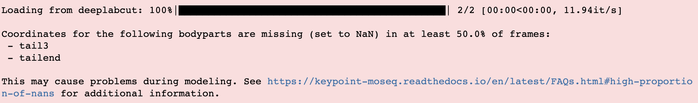

.. raw:: html

   <link rel="stylesheet" href="_static/FAQs_style.css">

Code usage
==========

**Besides the tutorials there are a few ways to learn how to use keypoint-MoSeq:**

- Use the docstrings. All functions in keypoint-MoSeq have docstrings that explain their inputs, outputs and purpose. The docstrings can be accessed on this site using the search bar. They can also be accessed while coding using ``help(function_name)`` or by adding a question mark, as in ``function_name?``.

- Join our `slack workspace <https://join.slack.com/t/moseqworkspace/shared_invite/zt-151x0shoi-z4J0_g_5rwJDlO1IfCU34A>`_. We are happy to answer questions and help troubleshoot issues.

- Search the `github issues <https://github.com/dattalab/keypoint-moseq/issues>`_ to see if anyone else has had a similar question.

Input data
==========

How much data do I need?
------------------------
As a rule of thumb, a few hours (a few hundred thousand frames) of data are needed. More data is better. Since keypoint-MoSeq uses a hierarchical Dirichlet process (HDP) prior, the number of distinct syllables detected will gradually increase with more input data. Therefore a larger dataset may be necessary to detect rare behaviors.

How many/which keypoints?
-------------------------
A fine starting point is 5-10 keypoints. For rodents, we recommend omitting the tail. The most important aspect is that the keypoints are informative and provide a holistic description of the animal's pose. If you are already tracking 4 keypoints along the spine, for example, adding 4 more may not add much new information. Note that it is always possible to exclude keypoints from modeling using the ``use_bodyparts`` setting in the config.

Multiple animals
----------------
- **For multi-animal experiments where the animals are comparable in size and shape** (e.g. same sex and strain), it is best to fit a single model to all the data from both animals, which will result in two or more syllable sequences for each video. To load multi-animal data from SLEAP or DeepLabCut, the same functions can be used as for single-animal data, and each tracked animal will be added as a separate key/value pair in the ``coordinates`` and ``confidences`` dictionaries. In SLEAP, for example, a single file called ``two_mice.h5`` will generate a pair of keys ``'two_mice_track0', 'two_mice_track1'``. In DeepLabCut, the name of each individual will be used as a suffix, e.g. ``'two_mice_mouseA', 'two_mice_mouseB'``. These keys can then be used at the end of modeling to access syllables for each animal.

- **For multi-animal experiments where the animals differ in size** (e.g. adults and pups), it is best to fit separate models. If the tracking data is contained in a single file, the ``use_bodyparts`` config option can be used to limit modeling to the subset of keypoints belonging to each animal respectively. If the tracking data for each type of animal is in separate files, then simply restrict to the appropriate files when loading the data. 

Keypoints are noisy
-------------------
In general, keypoint-MoSeq is tolerant to noise in keypoint tracking. During fitting, the model tries to detect and downweight tracking errors. It also takes advantage of neural network-based confidence estimates when they are available (which is typically the case for DeepLabCut and SLEAP). A good rule of thumb is to watch a video of the tracked keypoints. If you can tell what the animal is doing from the keypoints alone, then they likely provide a good starting point for keypoint-MoSeq.

High proportion of NaNs
-----------------------
If your keypoint tracking data contains a high proportion of NaNs, you may get the following warning when loading it with keypoint-MoSeq:

.. raw:: html

    

- Check if the NaNs are occuring in a specific subset of recordings. If they are, then it may be useful to exclude them from modeling, or to retrain the keypoint detection network with added training examples from the problematic recordings. For a recording-by-recording breakdown of NaNs, run

.. code-block:: python

   kpms.check_nan_proportions(coordinates, bodyparts, breakdown=True)

- Rerun keypoint detection with a lower threshold for missing data. In general, keypoint tracking algorithms such as SLEAP and DeepLabCut will mark a keypoint as NaN in a given frame if its confidence is below a certain level. In SLEAP, this level can be adjusted using the argument ``--peak_threshold`` when `running inference from the command line <https://sleap.ai/notebooks/Training_and_inference_on_an_example_dataset.html#inference>`_, e.g.

.. code-block:: python

   sleap-track VIDEO [other_args] --peak_threshold 0.05

Should I preprocess keypoints?
------------------------------
For 2D keypoint tracking we generally don't recommend this. Keypoint-MoSeq is designed to work with raw keypoints. Preprocessing (e.g., smoothing, filtering, etc.) may remove important information.

Head-fixed animals
------------------
We have only tested keypoint-MoSeq on freely moving animals, using either 2D keypoint detections from a top-down/bottom-up camera, or 3D keypoint detections inferred from multiple camera angles. But head-fixed animals could work in principle. In that case, one may wish to prevent keypoint-MoSeq from inferring heading angle and performing egocentric alignment. This can be done by setting ``fix_heading=True`` in the config.

Non-rodents
-----------
Keypoint-MoSeq has only been validated on rodents (mice, rats, and anecdotal success with naked mole rats), but there is no reason in principle that it wouldn't work on other species such as insects. If you try it on another species, please let us know how it goes! A key consideration for non-rodents is setting the target syllable duration, which may differ from the 400ms, which we recommend for rodents. For additional information, see :ref:`Choosing the target syllable duration <target duration>`.

.. _loading data:

Loading keypoint tracking data
------------------------------
Keypoint-MoSeq can be used with any method that produces 2D or 3D keypoint detections. Currently we support SLEAP, DeepLabCut, anipose, SLEAP-anipose, Neurodata Without Borders (NWB), Facemap, FreiPose and DANNCE. For methods not on this list, you can write a custom loading function or get in touch and request it as a new feature. 

- If using one of the supported formats, data can be loaded as follows, optionally replacing ``'deeplabcut'`` with one of the following: ``'sleap', 'anipose', 'sleap-anipose', 'nwb', 'facemap', 'freipose', 'DANNCE'``. The file formats expected in each case are described in the docstring for :py:func:`keypoint_moseq.io.load_keypoints`.

.. code-block:: python

   coordinates, confidences, bodyparts = kpms.load_keypoints(keypoint_data_path, 'deeplabcut')

- If writing your own data loader, the output should be a ``coordinates`` dictionary that maps recording names to arrays of shape ``(num_frames, num_keypoints, num_dimensions)``, where ``num_dimensions`` is 2 or 3. The keypoint axis should correspond to the `bodyparts` list in the config. You can also include a ``confidences`` dictionary that maps recording names to arrays of shape ``(num_frames, num_keypoints)``. If your loader applies to a commonly used keypoint inference method, please let us know! We'd love to add it for others to use.

- We are also happy to help write a loader for your data. Just open a `github issue <https://github.com/dattalab/keypoint-moseq/issues>`_ and describe the method you used for keypoint tracking and the format of the data, including the file format, how it is organized into directories, and how the output files are typically named (especially in relation to the corresponding videos). If possible, also send one or more example files to calebsw@gmail.com. 

Size variation between animals
------------------------------
Substantial size variation between animals may cause syllables to become over-fractionated, i.e. the same behaviors may be split into multiple syllables based on size alone. We plan to address this in a future release. Please get in touch if this is a pressing issue for you, either by opening a `github issue <https://github.com/dattalab/keypoint-moseq/issues>`_, or reaching out through our `Slack workspace <https://join.slack.com/t/moseqworkspace/shared_invite/zt-151x0shoi-z4J0_g_5rwJDlO1IfCU34A>`_.

3D keypoint data
----------------
Keypoint-MoSeq can be used with 3D keypoint data.

- For data loading, we support Anipose and SLEAP-anipose (see :ref:`Loading keypoint tracking data <loading data>`). 

- For visualization, :py:func:`keypoint_moseq.viz.plot_pcs` and :py:func:`keypoint_moseq.viz.generate_trajectory_plots` can be run exactly as described in the tutorial. Both functions will render 2D projections in the x/y and x/z planes and also generate 3D interactive plots. The 3D plots are rendered in the notebook and can also be viewed offline in a browser using the saved .html file. For grid movies, see :ref:`Making grid movies for 3D data <3d grid movies>`.

Modeling
========

Validating model outputs
------------------------
**To confirm that model fitting was successful, you can check the following:**

- Syllables have the target duration. You can check the median duration by inspecting the plots generated during fitting (as shown below). You can also plot the distribution of syllable durations using ``kpms.plot_duration_distribution(project_dir, model_name)``. If the median duration is below/above the target value, adjust the ``kappa`` hyperparameter and re-fit the model. Initially it may be necessary to change `kappa` by a factor of 10 or more. 

- The syllable labels stabilized during the last few iterations of model fitting. This can be checked by inspection of the heatmaps generated during model fitting (e.g. the right-most subplot below).

- The trajectory plots for each syllable are distinct and depict recognizable behaviors.

- The grid movies for each syllable are distinct and internally consistent. 

.. image:: _static/fitting_progress.png
   :align: center

.. raw:: html

    

.. _target duration:

Choosing the target syllable duration
-------------------------------------
For rodents we recommend a target duration of ~400ms (i.e. 12 frames at 30fps), since this timescale has been validated through analyses of behavior and neural activity in previous studies. For other animals or head-fixed setups, the target duration may be different, and depends mainly on the timescale of behavior that you are interested in.

Number of model fitting iterations
----------------------------------
It may be necessary to re-run the fitting process a few times to choose a good value for the `kappa` hyperparameter. During these initial runs, fitting need only be run until the syllable durations stabilize. This typically takes <10 for the initial (AR only) stage of fitting, and 10-50 iterations for the second (full model) stage. After setting ``kappa``, continue fitting until the syllable sequence stabilizes, e.g. 200-500 iterations. In our experience, the model fit improves somewhat from 200 to 500 iterations, but not after that.

Detecting existing syllables in new data
----------------------------------------
If you already have a trained a MoSeq model and would like to apply it to new data, you can do so using the ``apply_model`` function.

.. code-block:: python

   # load the most recent model checkpoint and pca object
   model = kpms.load_checkpoint(project_dir, model_name)[0]
   pca = kpms.load_pca(project_dir)

   # load new data (e.g. from deeplabcut)
   new_data = 'path/to/new/data/' # can be a file, a directory, or a list of files
   coordinates, confidences, bodyparts = kpms.load_keypoints(new_data, 'deeplabcut')
   data, metadata = kpms.format_data(coordinates, confidences, **config())

   # apply saved model to new data
   results = kpms.apply_model(model, data, metadata, project_dir, model_name, **config())

.. note::

   Some users have reported systematic differences in the way syllables are assigned when applying a model to new data. To control for this, we recommend running `apply_model` to both the new and original data and using these new results instead of the original model output. To save the original results, simply rename the original `results.h5` file or save the new results to a different filename using `results_path="new_file_name.h5"`.

Continue model fitting but with new data
----------------------------------------
If you already trained keypoint MoSeq model, but would like to improve it using newly collected data (without starting from scratch), then follow the recipe below. Briefly, the code shows how to load model parameters from a saved checkpoint and then use them as the starting point for a new round of model fitting.

.. code-block:: python

   import keypoint_moseq as kpms

   project_dir = 'project/directory'
   config = lambda: kpms.load_config(project_dir)
   model_name = 'name_of_model' (e.g. '2023_03_16-15_50_11')
   
   # load and format new data (e.g. from DeepLabCut)
   new_data = 'path/to/new/data/' # can be a file, a directory, or a list of files
   coordinates, confidences,bodyparts = kpms.load_keypoints(new_data, 'deeplabcut')
   data, metadata = kpms.format_data(coordinates, confidences, **config())

   # load previously saved PCA and model checkpoint
   pca = kpms.load_pca(project_dir)
   model = kpms.load_checkpoint(project_dir, model_name)[0]

   # initialize a new model using saved parameters
   model = kpms.init_model(
      data, pca=pca, params=model['params'], 
      hypparams=model['hypparams'], **config())
   
   # continue fitting, now with the new data
   model, model_name = kpms.fit_model(
      model, data, metadata, project_dir, ar_only=False, num_iters=200)[0]
      

Interpreting model outputs
--------------------------
The final output of keypoint MoSeq is a results .h5 file (and optionally a directory of .csv files) that contain the following information:

- Syllables
   The syllable label assigned to each frame (i.e. the state indexes assigned by the model).

- Centroid and heading
   The centroid and heading of the animal in each frame, as estimated by the model. 

- Latent state
   Low-dimensional representation of the animal's pose in each frame. These are similar to PCA scores, are modified to reflect the pose dynamics and noise estimates inferred by the model. 

Validating results when applying a model to new data
----------------------------------------------------
When applying a model to new data, it may be useful to generate new grid movies and trajectory plots so you can confirm that the meaning of the syllables has been preserved. Let's say you've already applied the model to new data as follows:

   .. code-block:: python

      # load new data (e.g. from deeplabcut)
      coordinates, confidences, bodyparts = kpms.load_keypoints(new_data_path, 'deeplabcut')
      data, metadata = kpms.format_data(coordinates, confidences, **config())

      # apply saved model to new data
      results = kpms.apply_model(model, data, metadata, project_dir, model_name, **config())

By default, the `results` dictionary above contains results for both the new and old data. To generate grid movies and trajectory plots for the new data only, we can subset the `results` dictionary to include only the new data. We will also need to specify alternative paths for saving the new movies and plots so the original ones aren't overwritten.

   .. code-block:: python
      
      import os 

      # only include results for the new data
      new_results = {k:v for k,v in results.items() if k in coordinates}

      # save trajectory plots for the new data
      output_dir = os.path.join(project_dir, model_name, "new_trajectory_plots")
      kpms.generate_trajectory_plots(
         coordinates, new_results, project_dir,model_name, output_dir=output_dir, **config()
      )

      # save grid movies for the new data
      output_dir = os.path.join(project_dir, model_name, "new_grid_movies")
      kpms.generate_grid_movies(
         new_results, project_dir, model_name, coordinates=coordinates, output_dir=output_dir, **config()
      );

Visualization
=============

.. _3d grid movies:

Making grid movies for 3D data
------------------------------

Grid movies show examples of each syllable. For 2D keypoints, these clips are cropped from the original video recordings and rotated so that the animal faces in a consistent direction. Doing the same thing for 3D data is complicated because:

   - there are usually multiple videos (from different angles) associated with each recording
   - 3D keypoints alone don't provide enough information to crop videos around the animal
   - rotating videos to change the heading only makes sense for top-down or bottom-up views
   
Below we provide two code recipes to get around these issues. The first recipe is simpler and recommended for people without much programming experience. 

1) Make grid movies that just show the keypoints (i.e., without showing clips from original videos). This can be done by setting ``keypoints_only=True`` when calling :py:func:`keypoint_moseq.viz.generate_grid_movies`, as shown below. It may be necessary to adjust ``keypoints_scale``, which determines the number of pixels per 3D unit (the default value ``keypoints_scale=1.0`` means that 1 unit in 3D space corresponds to 1 pixel in the grid movie).

   .. code-block:: python

      kpms.generate_grid_movies(
         results, 
         project_dir, 
         model_name, 
         coordinates=coordinates, 
         keypoints_only=True, 
         keypoints_scale=1,
         use_dims=[0,1], # controls projection plane
         **config());

2) Pick a camera angle and load the 2D keypoint detections from that camera. The exact code for this will depend on the format of the 2D keypoints and the way that the 3D keypoint files, 2D keypoint files, and video files are organized. To take a simple example, let's say you filmed a mouse from the top and the side, performed 2D keypoint detection using SLEAP, and now have the following files for each recording:

   .. code-block:: bash

      <video_dir>/
      ├──<recording_name>.h5        # 3D keypoints
      ├──top-<recording_name>.h5    # 2D keypoints from top camera
      ├──top-<recording_name>.mp4   # video from top camera
      ├──side-<recording_name>.h5   # 2D keypoints from side camera
      ├──side-<recording_name>.mp4  # video from side camera

   To make grid movies using the top-camera, you'd need to load the top-camera 2D keypoints and match them up with the modeling results (which were most likely named using the 3D keypoints files), then compute 2D centroids and headings, and finally pass everything to :py:func:`keypoint_moseq.viz.generate_grid_movies`.

   .. code-block:: python

      video_dir = ... # insert path to video directory

      coordinates_2D,_,_ = kpms.load_keypoints(f'{video_dir}/top-*', 'sleap')
      video_paths = kpms.find_matching_videos(coordinates_2D.keys(), video_dir, as_dict=True)

      # rename keys to match the results dictionary
      coordinates_2D = {k.replace('top-', ''): v for k, v in coordinates_2D.items()}
      video_paths    = {k.replace('top-', ''): v for k, v in video_paths.items()}

      # compute the 2D centroid and heading
      centroids, headings = kpms.get_centroids_headings(coordinates_2D, **config())

      # make the grid movies
      kpms.generate_grid_movies(
         results, 
         project_dir, 
         model_name, 
         video_paths=video_paths,
         coordinates=coordinates_2D, 
         centroids=centroids,
         headings=headings,
         **config());

   You could follow a similar procedure for the side camera, but adding an extra line to zero-out the heading so the video clips aren't rotated.

   .. code-block:: python

      heading = {k: np.zeros_like(v) for k,v in heading.items()}

Why are there only trajectory plots for a subset of syllables?
--------------------------------------------------------------

There are two reasons why a syllable might be excluded from the trajectory plots:

1) It's frequency is below ``min_frequency``. By default ``min_frequency=0.005``, meaning that the syllable must make up at least 0.5% of all syllable instances. Lowering ``min_frequency`` may result in more syllables being included in the trajectory plots.

2) There aren't enough usable instances of the syllable. The number of required instances (50 by default) is set by the ``n_neighbors`` key of the ``sampling_options`` parameter. If you want to lower this number, (e.g. to 20) then you could call ``generate_trajectory_plots`` as follows.

   .. code-block:: python

      kpms.generate_trajectory_plots(..., sampling_options={"mode": "density", "n_neighbors": 20})

   Note that the number of *usable* syllable instances may be less than the total number of instances. Three criteria determine whether an instance is usable:

   - ``pre``: the number of frames prior to syllable onset that are included in the trajectory. By default, ``pre=5``, meaning that the trajectory will include the 5 frames prior to syllable onset. If a particular syllable instance starts within the first 5 frames of the video, then it is excluded.

   - ``post``: the number of frames after syllable onset that are included in the trajectory. By default, ``post=15``, meaning that the trajectory will include the 15 frames after syllable onset. If a particular syllable instance starts within the last 15 frames of the video, then it is excluded.

   - ``min_duration``: the minimum duration of a syllable instance. By default, ``min_duration=3``, meaning that syllable instances lasting less than 3 frames are excluded.

In summary, the following parameter changes will tend to increase the number of syllables included in the trajectory plots: 

- Lowering ``min_frequency`` (e.g. to 0.001)

- Lowering ``n_neighbors`` (e.g. to 20)

- Lowering ``pre`` (at this point you're scraping the bottom of the barrel)

- Lowering ``post`` (again, scraping the bottom of the barrel here)

- Lowering ``min_duration`` (this should be avoided; why are your syllables so short?)

Why are there only grid movies for a subset of syllables?
---------------------------------------------------------

There are two reasons why a syllable might not have a grid movie:

1) It's frequency is below ``min_frequency``. By default ``min_frequency=0.005``, meaning that the syllable must make up at least 0.5% of all syllable instances. Lowering ``min_frequency`` may result in more syllables being included among the grid movies.

2) There aren't enough usable instances of the syllable. There have to be at least enough instances to fill up every cell of the grid. The number of grid cells is determined by the ``rows`` and ``cols`` parameters. Note that the number of *usable* syllable instances may be less than the total number of instances. Three criteria determine whether an instance is usable:

   - ``pre``: the number of frames prior to syllable onset that are included in the grid movie. By default, ``pre=30``, meaning that movie in each grid cell starts 30 frames prior to syllable onset. So if a particular syllable instance starts within the first 30 frames of the experiment, then it is excluded.

   - ``post``: the number of frames after syllable onset that are included in the grid movie. By default, ``post=60``, meaning that the movie in each grid cell ends 60 frames after syllavle onset. If a particular syllable instance starts within the last 60 frames of the experiment, then it is excluded.

   - ``min_duration``: the minimum duration of a syllable instance. By default, ``min_duration=3``, meaning that syllable instances lasting less than 3 frames are excluded.

In summary, the following parameter changes will tend to increase the number of syllables included in the grid movies:

- Lowering ``min_frequency`` (e.g. to 0.001)

- Lowering ``pre`` (at this point you're scraping the bottom of the barrel)

- Lowering ``post`` (again, scraping the bottom of the barrel here)

- Lowering ``min_duration`` (this should be avoided; why are your syllables so short?)

Why do my trajectory plots and grid movies disagree?
----------------------------------------------------

Users occasionally find that the trajectory plot and grid movie for a given syllable don't match up. For example the animal might turn left in the trajectory plot but not consistently do so in the grid movie. Similarly, trajectory plots can occasionally change dramatically when a trained keypoint-MoSeq model is applied to new data. In most cases, these inconsistencies are caused by **density sampling of syllable instances**. Turning this feature off may result in more stable trajectory plots.

.. code-block:: python

   kpms.generate_trajectory_plots(..., density_sample=False)

Density sampling is a way of selecting syllable instances that are most representative relative to the full dataset. Specifically, for each syllable, a syllable-specific density function is computed in trajectory space and compared to the overall density across all syllables. An exemplar instance that maximizes the ratio between these densities is chosen for each syllable, and its nearest neighbors are randomly sampled. When the distribution of trajectories for a syllable is multimodal (i.e., it represents a mixture of distinct behaviors), the examplar syllable may not capture the full range of behaviors, or it may jump from one mode to another when an existing model is applied to new data. In these cases, it may be better to sample syllable instances uniformly by setting turning off density sampling as shown above.

Troubleshooting
===============

We are contiually updating the keypoint MoSeq code in response to user feedback and issues, so please make sure you are using the latest version. You can check the version by running ``kpms.__version__`` (note that for versions ≤0.0.5, the latter command will cause an error). To update to the latest version, run the following in a command terminal with the ``keypoint_moseq`` conda environment activated (not inside a jupyter notebook!).
   
.. code-block:: python

    pip install --U keypoint_moseq 

Note that for any already open notebooks, you will need to restart the kernel to use the updated version. If your problem remains after troubleshooting, please open a `github issue <https://github.com/dattalab/keypoint-moseq/issues>`_. 

Dead kernel
-----------

On Windows, GPU out of memory (OOM) errors may cause silent kernel failure. To determine whether this is the likely cause, try re-fitting the model using a small subset of the data. If the kernel still dies, then it is likely a different issue. If the kernel does not die, then it is likely an OOM error. Some workarounds for OOM errors are described below.

Out of memory
-------------

There are two main causes of GPU out of memory (OOM) errors:

1. **Multiple instances of keypoint MoSeq are running on the same GPU.** 

  This can happen if you're running multiple notebooks or scripts at the same time. Since JAX preallocates 90% of the GPU when it is first initialized (i.e. after running ``import keypoint_moseq``), there is very little memory left for the second notebook/script. To fix this, you can either shutdown the kernels of the other notebooks/scripts or use a different GPU.

2. **Large datasets.** 

  Keypoint MoSeq requires ~1MB GPU memory for each 100 frames of data during model fitting. If your GPU isn't big enough, try one of the following:

  - Use `Google colab <https://colab.research.google.com/github/dattalab/keypoint-moseq/blob/main/docs/keypoint_moseq_colab.ipynb>`_. 

    - Colab provides free access to GPUs with 16GB of VRAM.

    - Larger GPUs can be accessed using colab pro. 

  - Disable parallel message passing. This should results in a 2-5x reduction in memory usage, but will also slow down model fitting by a similar factor. To disable parallel message passing, pass ``parallel_message_passing=False`` to :py:func:`keypoint_moseq.fit_model` or :py:func:`keypoint_moseq.apply_model`. For example

   .. code-block:: python

      kpms.fit_model(
         model, data, metadata, project_dir, 
         model_name, parallel_message_passing=False)

  - Partially serialize the computations. By default, modeling is parallelized across the full dataset. We also created an option for mixed parallel/serial computation where the data is split into batches that are processed serially. To enable this option, run the following code *before fitting the model* (if you have already initiated model fitting the kernel must be restarted).

   .. code-block:: python

      from jax_moseq.utils import set_mixed_map_iters
      set_mixed_map_iters(4)

   This will split the data into 4 batches, which should reduce the memory requirements about 4-fold but also result in a 4-fold slow-down. The number of batches can be adjusted as needed.

  - Use multiple GPUs if they are available. To split the computation across GPUs, run the following code *before fitting the model* (if you have already initiated model fitting the kernel must be restarted).

   .. code-block:: python

      from jax_moseq.utils import set_mixed_map_gpus
      set_mixed_map_gpus(2)

   This will split the computation across two GPUs. The number should be adjusted according to your hardware setup. 

  - Switch to single-precision computing by running the code below immediarely after importing keypoint MoSeq. Note that this may result in numerical instability which will cause NaN values to appear during fitting. Keypoint MoSeq will abort fitting if this occurs.

  .. code-block:: python
   
      import jax
      jax.config.update('jax_enable_x64', False)

    
  - Fit to a subset of the data, then apply the model to the rest of the data. 

    - To fit a subset of the data, specify the subset as a list of paths during data loading

      .. code-block:: python

        initial_data = ['path/to/file1.h5', 'path/to/file2.h5']
        coordinates, confidences, bodyparts = kpms.load_keypoints(initial_data, 'deeplabcut')

    - After model fitting, apply the model serially to new data as follows

      .. code-block:: python

        model = kpms.load_checkpoint(project_dir, model_name)[0]
        pca = kpms.load_pca(project_dir)

        new_data_batch1 = ['path/to/file3.h5', 'path/to/second/file4.h5']
        new_data_batch2 = ['path/to/file5.h5', 'path/to/second/file6.h5']

        for batch in [initial_data, new_data_batch1, new_data_batch2]:

            coordinates, confidences, bodyparts = kpms.load_keypoints(batch, 'deeplabcut')
            data, metadata = kpms.format_data(coordinates, confidences, **config())
            results = kpms.apply_model(model, data, metadata, project_dir, model_name, **config())

NaNs during fitting
-------------------

The following actions may help resolve NaNs during model fitting. If they don't, please contact calebsw@gmail.com and include the data, config file, and code used for fitting, as well as the most recent model checkpoint. 

- Make sure you are using double-precision computing. Check the precision using

.. code-block:: python

    import jax
    jax.config.read('jax_enable_x64')

- Try increasing adjusting the `jitter` parameter, which controls the amount of regularization used to prevent singular matrices. The default value is 1e-3, but it may be necessary to increase this to 1e-2 or 1e-1 using the `jitter` keyword argument in `fit_model`.

- Enable parallel Kalman sampling. By default, it is only enabled when fittin with a GPU. You can override this, however, using the argument `parallel_message_passing=True` when running `fit_model`.

Installation errors
-------------------

- ``UNKNOWN: no kernel image is available for execution on the device``

  If you're running into issues when trying to use the GPU-accelerated version, you might see this error message::

     jaxlib.xla_extension.XlaRuntimeError: UNKNOWN: no kernel image is available for execution on the device

  First, check if jax can detect your GPU::

     python -c "import jax; print(jax.default_backend())

  The result should be "gpu". If it isn't, then you might not be using the right version of ``cudatoolkit`` or ``cudnn``. If you installed these via ``conda``, you can check by doing a ``conda list | grep cud``. If you are on the right versions, try `updating your GPU driver to the latest version <https://nvidia.com/drivers>`_.
