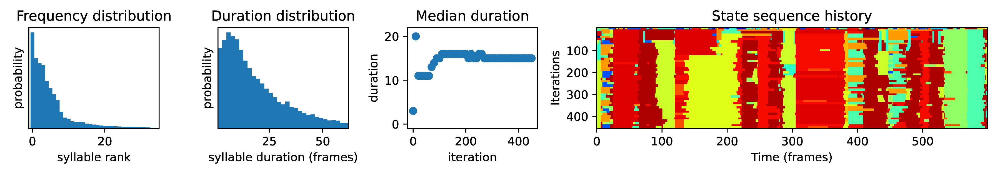

.. raw:: html

   <link rel="stylesheet" href="_static/FAQs_style.css">

Code usage
==========

**Besides the tutorials there are a few ways to learn how to use keypoint-MoSeq:**

- Use the docstrings. All functions in keypoint-MoSeq have docstrings that explain their inputs, outputs and purpose. The docstrings can be accessed on this site using the search bar. They can also be accessed while coding using ``help(function_name)`` or by adding a question mark, as in ``function_name?``.

- Join our `slack workspace <https://join.slack.com/t/moseqworkspace/shared_invite/zt-151x0shoi-z4J0_g_5rwJDlO1IfCU34A>`_. We are happy to answer questions and help troubleshoot issues.

- Search the `github issues <https://github.com/dattalab/keypoint-moseq/issues>`_ to see if anyone else has had a similar question.

Input data
==========

How much data do I need?
------------------------
As a rule of thumb, a few hours (a few hundred thousand frames) of data are needed. More data is better. Since keypoint-MoSeq uses a hierarchical Dirichlet process (HDP) prior, the number of distinct syllables detected will gradually increase with more input data. Therefore a larger dataset may be necessary to detect rare behaviors.

How many/which keypoints?
-------------------------
A fine starting point is 5-10 keypoints. For rodents, we recommend omitting the tail. The most important aspect is that the keypoints are informative and provide a holistic description of the animal's pose. If you are already tracking 4 keypoints along the spine, for example, adding 4 more may not add much new information. Note that it is always possible to exclude keypoints from modeling using the ``use_bodyparts`` setting in the config.

Multiple animals
----------------
- **For multi-animal experiments where the animals are comparable in size and shape** (e.g. same sex and strain), it is best to fit a single model to all the data from both animals, which will result in two or more syllable sequences for each video. To load multi-animal data from SLEAP or DeepLabCut, the same functions can be used as for single-animal data, and each tracked animal will be added as a separate key/value pair in the ``coordinates`` and ``confidences`` dictionaries. In SLEAP, for example, a single file called ``two_mice.h5`` will generate a pair of keys ``'two_mice_track0', 'two_mice_track1'``. In DeepLabCut, the name of each individual will be used as a suffix, e.g. ``'two_mice_mouseA', 'two_mice_mouseB'``. These keys can then be used at the end of modeling to access syllables for each animal.

- **For multi-animal experiments where the animals differ in size** (e.g. adults and pups), it is best to fit separate models. If the tracking data is contained in a single file, the ``use_bodyparts`` config option can be used to limit modeling to the subset of keypoints belonging to each animal respectively. If the tracking data for each type of animal is in separate files, then simply restrict to the appropriate files when loading the data. 

Keypoints are noisy
-------------------
In general, keypoint-MoSeq is tolerant to noise in keypoint tracking. During fitting, the model tries to detect and downweight tracking errors. It also takes advantage of neural network-based confidence estimates when they are available (which is typically the case for DeepLabCut and SLEAP). A good rule of thumb is to watch a video of the tracked keypoints. If you can tell what the animal is doing from the keypoints alone, then they likely provide a good starting point for keypoint-MoSeq.

High proportion of NaNs
-----------------------
If your keypoint tracking data contains a high proportion of NaNs, you may get the following warning when loading it with keypoint-MoSeq:

.. image:: _static/nan_warning.png
   :align: center

.. raw:: html

    

- Check if the NaNs are occuring in a specific subset of sessions. If they are, then it may be useful to exclude them from modeling, or to retrain the keypoint detection network with added training examples from the problematic sessions. For a session-by-session breakdown of NaNs, run::

   kpms.check_nan_proportions(coordinates, bodyparts, breakdown=True)

- Rerun keypoint detection with a lower threshold for missing data. In general, keypoint tracking algorithms such as SLEAP and DeepLabCut will mark a keypoint as NaN in a given frame if its confidence is below a certain level. In SLEAP, this level can be adjusted using the ``--peak_threshold`` argument when `running inference from the command line <https://sleap.ai/notebooks/Training_and_inference_on_an_example_dataset.html#inference>`_::

   sleap-track VIDEO [other_args] --peak_threshold 0.05

Should I preprocess keypoints?
------------------------------
For 2D keypoint tracking we generally don't recommend this. Keypoint-MoSeq is designed to work with raw keypoints. Preprocessing (e.g., smoothing, filtering, etc.) may remove important information.

Head-fixed animals
------------------
We have only tested keypoint-MoSeq on freely moving animals, using either 2D keypoint detections from a top-down/bottom-up camera, or 3D keypoint detections inferred from multiple camera angles. But head-fixed animals could work in principle. In that case, one may wish to prevent keypoint-MoSeq from inferring heading angle and performing egocentric alignment. This can be done by setting ``fix_heading=True`` in the config.

Non-rodents
-----------
Keypoint-MoSeq has only been validated on rodents (mice, rats, and anecdotal success with naked mole rats), but there is no reason in principle that it wouldn't work on other species such as insects. If you try it on another species, please let us know how it goes! A key consideration for non-rodents is setting the target syllable duration, which may differ from the 400ms, which we recommend for rodents. For additional information, see :ref:`Choosing the target syllable duration <target duration>`.

Loading data from methods other than SLEAP or DeepLabCut
--------------------------------------------------------
Keypoint-MoSeq can be used with any method that produces 2D or 3D keypoint detections. You can write a custom loading function or get in touch and request it as a new feature. 

- If writing your own data loader, the output should be a ``coordinates`` dictionary that maps session names to arrays of shape ``(num_frames, num_keypoints, num_dimensions)``, where ``num_dimensions`` is 2 or 3. The keypoint axis should correspond to the `bodyparts` list in the config. You can also include a ``confidences`` dictionary that maps session names to arrays of shape ``(num_frames, num_keypoints)``. If your loader applies to a commonly used keypoint inference method, please let us know! We'd love to add it for others to use.

-  We are also happy to help write a loader for your data. Just open a `github issue <https://github.com/dattalab/keypoint-moseq/issues>`_ and describe the method you used for keypoint tracking and the format of the data, including the file format, how it is organized into directories, and how the output files are typically named (especially in relation to the corresponding videos). If possible, also send one or more example files to calebsw@gmail.com. 

Size variation between animals
------------------------------
Substantial size variation between animals may cause syllables to become over-fractionated, i.e. the same behaviors may be split into multiple syllables based on size alone. We plan to address this in a future release. Please get in touch if this is a pressing issue for you, either by opening a `github issue <https://github.com/dattalab/keypoint-moseq/issues>`_, or reaching out through our `Slack workspace <https://join.slack.com/t/moseqworkspace/shared_invite/zt-151x0shoi-z4J0_g_5rwJDlO1IfCU34A>`_.

Modeling
========

Validating model outputs
------------------------
**To confirm that model fitting was successful, you can check the following:**

- Syllables have the target duration. You can check the median duration by inspecting the plots generated during fitting (as shown below). You can also plot the distribution of syllable durations using ``kpms.plot_duration_distribution(name=name, project_dir=project_dir)``. If the median duration is below/above the target value, adjust the ``kappa`` hyperparameter and re-fit the model. Initially it may be necessary to change `kappa` by a factor of 10 or more. 

- The syllable labels stabilized during the last few iterations of model fitting. This can be checked by inspection of the heatmaps generated during model fitting (e.g. the right-most subplot below).

- The trajectory plots for each syllable are distinct and depict recognizable behaviors.

- The grid movies for each syllable are distinct and internally consistent. 

.. raw:: html

    

.. _target duration:

Choosing the target syllable duration
-------------------------------------
For rodents we recommend a target duration of ~400ms (i.e. 12 frames at 30fps), since this timescale has been validated through analyses of behavior and neural activity in previous studies. In the `keypoint-MoSeq paper <https://www.biorxiv.org/content/10.1101/2023.03.16.532307v2>`_, we use changepoint analysis to support the choice of 400ms as the target duration. To repeat this analysis, follow the changepoints tutorial. For other animals or head-fixed setups, the target duration may be different, and depends mainly on the timescale of behavior that you are interested in.

Number of model fitting iterations
----------------------------------
It may be necessary to re-run the fitting process a few times to choose a good value for the `kappa` hyperparameter. During these initial runs, fitting need only be run until the syllable durations stabilize. This typically takes <10 for the initial (AR only) stage of fitting, and 10-50 iterations for the second (full model) stage. After setting ``kappa``, continue fitting until the syllable sequence stabilizes, e.g. 200-500 iterations. In our experience, the model fit improves somewhat from 200 to 500 iterations, but not after that.

Detecting existing syllables in new data
----------------------------------------
If you already have a trained a MoSeq model and would like to apply it to new data, you can do so using the ``apply_model`` function. This function takes as input the coordinates (and confidences) of the new data, and returns the syllable sequence and other outputs of the model. For example::

   # load saved model checkpoint
   checkpoint = kpms.load_checkpoint(project_dir=project_dir, name=name)

   # load new data (e.g. from deeplabcut)
   new_data = 'path/to/new/data/' # can be a file, a directory, or a list of files
   coordinates, confidences = kpms.load_deeplabcut_results(new_data)

   results = kpms.apply_model(coordinates=coordinates, confidences=confidences, 
                              project_dir=project_dir, pca=kpms.load_pca(project_dir),
                              **config(), **checkpoint)

Troubleshooting
===============

We are contiually updating the keypoint MoSeq code in response to user feedback and issues, so please make sure you are using the latest version. You can check the version by running ``kpms.__version__`` (note that for versions ≤0.0.5, the latter command will cause an error). To update to the latest version, run the following inside the ``keypoint_moseq`` conda environment::
   
    pip install --U keypoint_moseq 

If your problem remains after troubleshooting, please open a `github issue <https://github.com/dattalab/keypoint-moseq/issues>`_. 

Dead kernel
-----------

On Windows, GPU out of memory (OOM) errors may cause silent kernel failure. To determine whether this is the likely cause, compare keypoint MoSeq's expected memory usage during model fitting (roughly 1MB per 100 frames of data) to the total memory available (VRAM) on your GPU. To check the total available VRAM, use ``nvidia-smi`` for Mac and Linux or the Task Manager in Windows. 

Out of memory
-------------

There are two main causes of GPU out of memory (OOM) errors:

1. **Multiple instances of keypoint MoSeq are running on the same GPU.** 

  This can happen if you're running multiple notebooks or scripts at the same time. Since JAX preallocates 90% of the GPU when it is first initialized (i.e. after running ``import keypoint_moseq``), there is very little memory left for the second notebook/script. To fix this, you can either shutdown the kernels of the other notebooks/scripts or use a different GPU.

2. **Large datasets.** 

  Keypoint MoSeq requires ~1MB GPU memory for each 100 frames of data during model fitting. If your GPU isn't big enough, try one of the following:

  - Use `Google colab <https://colab.research.google.com/github/dattalab/keypoint-moseq/blob/main/docs/keypoint_moseq_colab.ipynb>`_. 

    - Colab provides free access to GPUs with 16GB of VRAM.

    - Larger GPUs can be accessed using colab pro. 

  - Switch to single-precision computing by running the code below immediarely after importing keypoint MoSeq. Note that this may result in numerical instability which will cause NaN values to appear during fitting. Keypoint MoSeq will abort fitting if this occurs::

      import jax
      jax.config.update('jax_enable_x64', False)

    
  - Fit to a subset of the data, then apply the model to the rest of the data. 

    - To fit a subset of the data, specify the subset as a list of paths during data loading::

        initial_data = ['path/to/file1.h5', 'path/to/file2.h5']
        coordinates, confidences = kpms.load_deeplabcut_results(initial_data)

    - After model fitting, apply the model serially to new data as follows::

        checkpoint = kpms.load_checkpoint(project_dir=project_dir, name=name)

        new_data_batch1 = ['path/to/file3.h5', 'path/to/second/file4.h5']
        new_data_batch2 = ['path/to/file5.h5', 'path/to/second/file6.h5']

        for batch in [initial_data, new_data_batch1, new_data_batch2]:

            coordinates, confidences = kpms.load_deeplabcut_results(batch)

            results = kpms.apply_model(
                coordinates=coordinates, confidences=confidences, 
                use_saved_states=False, pca=kpms.load_pca(project_dir),
                project_dir=project_dir, **config(), **checkpoint, num_iters=5)

NaNs during fitting
-------------------

NaNs are much more likely with single-precision computing. Check the precision using::

    import jax
    jax.config.read('jax_enable_x64')

If the output is ``True`` (i.e. JAX is using double-precision), then please contact calebsw@gmail.com and include the config, the data used for fitting, and the most recent model checkpoint. 

Installation errors
-------------------

- ``UNKNOWN: no kernel image is available for execution on the device``

  If you're running into issues when trying to use the GPU-accelerated version, you might see this error message::

     jaxlib.xla_extension.XlaRuntimeError: UNKNOWN: no kernel image is available for execution on the device

  First, check if jax can detect your GPU::

     python -c "import jax; print(jax.default_backend())

  The result should be "gpu". If it isn't, then you might not be using the right version of ``cudatoolkit`` or ``cudnn``. If you installed these via ``conda``, you can check by doing a ``conda list | grep cud``. If you are on the right versions, try `updating your GPU driver to the latest version <https://nvidia.com/drivers>`_.
