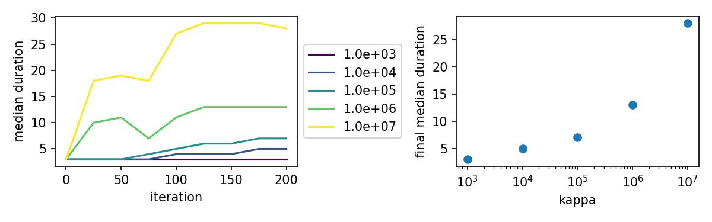
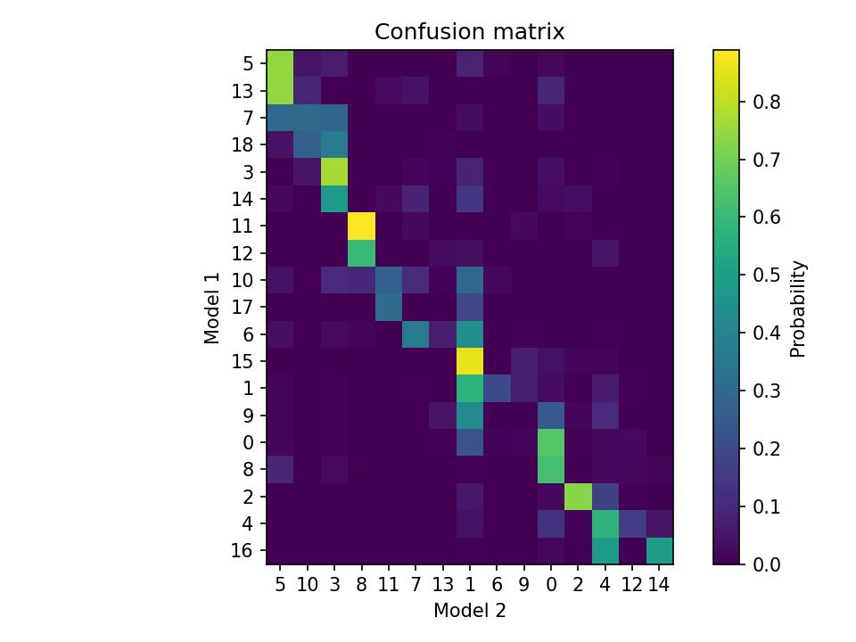
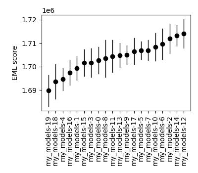

Exporting pose estimates
------------------------

During fitting, keypoint-MoSeq tries to estimate the "true" pose trajectory of the animal, discounting anomolous or low-confidence keypoints. The pose trajectory is stored in the model as a variable "x" that encodes a low-dimensional representation of the keypoints (similar to PCA). The code below shows how to project the pose trajectory back into the original coordinate space. This is useful for visualizing the estimated pose trajectory.

.. code-block:: python

    import os
    import h5py
    import numpy as np
    import jax.numpy as jnp
    from jax_moseq.utils import unbatch
    from jax_moseq.models.keypoint_slds import estimate_coordinates

    # load the model (change project_dir and model_name as needed)
    project_dir = 'demo_project'
    model_name = '2023_08_01-10_16_25'
    model, _, metadata, _ = kpms.load_checkpoint(project_dir, model_name)

    # compute the estimated coordinates
    Y_est = estimate_coordinates(
        jnp.array(model['states']['x']),
        jnp.array(model['states']['v']),
        jnp.array(model['states']['h']),
        jnp.array(model['params']['Cd'])
    )

    # generate a dictionary with reconstructed coordinates for each recording
    coordinates_est = unbatch(Y_est, *metadata)

The following code generates a video showing frames 0-3600 from one recording with the reconstructed keypoints overlaid.

.. code-block:: python

    config = lambda: kpms.load_config(project_dir)
    keypoint_data_path = 'dlc_project/videos' # can be a file, a directory, or a list of files
    coordinates, confidences, bodyparts = kpms.load_keypoints(keypoint_data_path, 'deeplabcut')

    recording_name = '21_11_8_one_mouse.top.irDLC_resnet50_moseq_exampleAug21shuffle1_500000'
    video_path = 'dlc_project/videos/21_11_8_one_mouse.top.ir.mp4'

    output_path = os.path.splitext(video_path)[0]+'.reconstructed_keypoints.mp4'
    start_frame, end_frame = 0, 3600

    kpms.overlay_keypoints_on_video(
        video_path,
        coordinates_est[recording_name],
        skeleton = config()['skeleton'],
        bodyparts = config()['use_bodyparts'],
        output_path = output_path,
        frames = range(start_frame, end_frame)
    )

Automatic kappa scan
--------------------

Keypoint-MoSeq includes a hyperparameter called ``kappa`` that determines the rate of transitions between syllables. Higher values of kappa lead to longer syllables and smaller values lead to shorter syllables. Users should choose a value of kappa based their desired distribution of syllable durations. The code below shows how to automatically scan over a range of kappa values and choose the optimal value.

.. note::

    The following code reduces ``kappa`` by a factor of 10 (``decrease_kappa_factor``) before fitting the full model. You will need to recapitulate this step when fitting your own final model.
    

.. code-block:: python

    import numpy as np

    kappas = np.logspace(3,7,5)
    decrease_kappa_factor = 10
    num_ar_iters = 50
    num_full_iters = 200

    prefix = 'my_kappa_scan'

    for kappa in kappas:
        print(f"Fitting model with kappa={kappa}")
        model_name = f'{prefix}-{kappa}'
        model = kpms.init_model(data, pca=pca, **config())
        
        # stage 1: fit the model with AR only
        model = kpms.update_hypparams(model, kappa=kappa)
        model = kpms.fit_model(
            model, 
            data, 
            metadata, 
            project_dir, 
            model_name, 
            ar_only=True, 
            num_iters=num_ar_iters, 
            save_every_n_iters=25
        )[0];

        # stage 2: fit the full model
        model = kpms.update_hypparams(model, kappa=kappa/decrease_kappa_factor)
        kpms.fit_model(
            model, 
            data, 
            metadata, 
            project_dir, 
            model_name, 
            ar_only=False, 
            start_iter=num_ar_iters,
            num_iters=num_full_iters, 
            save_every_n_iters=25
        );

    kpms.plot_kappa_scan(kappas, project_dir, prefix)

Model selection and comparison
------------------------------

Keypoint-MoSeq uses a stochastic fitting procedure, and thus produces slightly different syllable segmentations when run multiple times with different random seeds. Below, we show how to fit multiple models, compare the resulting syllables, and then select an optimal model for further analysis. It may also be useful in some cases to show that downstream analyses are robust to the choice of model.

.. _fitting-multiple-models:

Fitting multiple models
~~~~~~~~~~~~~~~~~~~~~~~

The code below shows how to fit multiple models with different random seeds.

.. code-block:: python

    import jax

    num_model_fits = 20
    prefix = 'my_models'

    ar_only_kappa = 1e6
    num_ar_iters = 50

    full_model_kappa = 1e4
    num_full_iters = 500

    for restart in range(num_model_fits):
        print(f"Fitting model {restart}")
        model_name = f'{prefix}-{restart}'
        
        model = kpms.init_model(
            data, pca=pca, **config(), seed=jax.random.PRNGKey(restart)
        )

        # stage 1: fit the model with AR only
        model = kpms.update_hypparams(model, kappa=ar_only_kappa)
        model = kpms.fit_model(
            model,
            data, 
            metadata, 
            project_dir, 
            model_name,
            ar_only=True, 
            num_iters=num_ar_iters
        )[0]

        # stage 2: fit the full model
        model = kpms.update_hypparams(model, kappa=full_model_kappa)
        kpms.fit_model(
            model, 
            data, 
            metadata, 
            project_dir, 
            model_name,
            ar_only=False, 
            start_iter=num_ar_iters,
            num_iters=num_full_iters
        );

        kpms.reindex_syllables_in_checkpoint(project_dir, model_name);
        model, data, metadata, current_iter = kpms.load_checkpoint(project_dir, model_name)
        results = kpms.extract_results(model, metadata, project_dir, model_name)
        
        

Comparing syllables
~~~~~~~~~~~~~~~~~~~

To get a sense of the variability across model runs, it may be useful to compare syllables produced by each model. The code below shows how to load results from two models runs (e.g., produced by the code above) and plot a confusion matrix showing the overlap between syllable labels.

.. code-block:: python

    model_name_1 = 'my_models-0'
    model_name_2 = 'my_models-1'

    results_1 = kpms.load_results(project_dir, model_name_1)
    results_2 = kpms.load_results(project_dir, model_name_2)

    kpms.plot_confusion_matrix(results_1, results_2);

Selecting a model
~~~~~~~~~~~~~~~~~

We developed a matric called the expected marginal likelihood (EML) score that can be used to rank models. To calculate EML scores, you must first fit an ensemble of models to a given dataset, as shown in :ref:`Fitting multiple models <fitting-multiple-models>`. The code below loads this ensemble and then calculates the EML score for each model. The model with the highest EML score can then be selected for further analysis.

.. code-block:: python

    # change the following line as needed
    model_names = ['my_models-{}'.format(i) for i in range(20)]

    eml_scores, eml_std_errs = kpms.expected_marginal_likelihoods(project_dir, model_names)
    best_model = model_names[np.argmax(eml_scores)]
    print(f"Best model: {best_model_name}")

    kpms.plot_eml_scores(eml_scores, eml_std_errs, model_names)

Model averaging
~~~~~~~~~~~~~~~

Keypoint-MoSeq is probabilistic. So even once fitting is complete and the syllable parameters are fixed, there is still a distribution of possible syllable sequences given the observed data. In the default pipeline, one such sequence is sampled from this distribution and used for downstream analyses. Alternatively, one can estimate the marginal probability distribution over syllable labels at each timepoint. The code below shows how to do this. It can be applied to new data or the same data that was used for fitting (or a combination of the two).

.. code-block:: python

    burnin_iters = 200
    num_samples = 100
    steps_per_sample = 5

    # load the model (change `project_dir` and `model_name` as needed)
    model = kpms.load_checkpoint(project_dir, model_name)[0]

    # load data (e.g. from deeplabcut)
    data_path = 'path/to/data/' # can be a file, a directory, or a list of files
    coordinates, confidences, bodyparts = kpms.load_keypoints(data_path, 'deeplabcut')
    data, metadata = kpms.format_data(coordinates, confidences, **config())

    # compute the marginal probabilities of syllable labels
    marginal_probs = kpms.estimate_syllable_marginals(
        model, data, metadata, burnin_iters, num_samples, steps_per_sample, **config()
    )

Location-aware modeling
-----------------------

Because keypoint-MoSeq uses centered and aligned pose estimates to define syllables, it is effectively blind to absolute movements of the animal in space. The only thing that keypoint-MoSeq normally cares about is change in pose -- defined here as the relative location of each keypoint. For example, if an animal were capable of simply sliding forward without otherwise moving, this would fail to show up in the syllable segmentation. To address this gap, we developed an experimental version of keypoint-MoSeq that leverages location and heading dynamics (in addition to pose) when defining syllables. To use this "location-aware" model, simply pass ``location_aware=True`` as an additional argument when calling the following functions.

- :py:func:`keypoint_moseq.fitting.init_model`
- :py:func:`keypoint_moseq.fitting.fit_model`
- :py:func:`keypoint_moseq.fitting.apply_model`
- :py:func:`keypoint_moseq.fitting.estimate_syllable_marginals`

Hyperparameters for the location-aware model are contained in the usual keypoint-moseq config file. These parameters can be adjusted to control the relative weight of keypoints, location, and heading dynamics in defining syllables. Higher values of the "alpha" hyperparameters and lower values of the "beta" hyperparameters will increase the relative weight of location and heading dynamics respectively. The code below shows how to update the config file before calling ``init_model``.

.. code-block:: python

    keypoint_moseq.update_config(
        project_dir, alpha0_v=10, beta0_v=0.1, alpha0_h=10, beta0_h=0.1
    )

Note that the location-aware model was not tested in the keypoint-MoSeq paper remains experimental. We welcome feedback and suggestions for improvement.

Mathematical details
~~~~~~~~~~~~~~~~~~~~

In the published version of keypoint-MoSeq, the animal's location :math:`v_t` and heading :math:`h_t` at each timepoint are conditionally independent of the current syllable :math:`z_t`. In particular, we assume

.. math::
    v_{t+1} & \sim \mathcal{N}(v_t, \sigma^2_\text{loc} I_2) \\
    h_{t+1} & \sim \text{Uniform}(-\pi, \pi)

In the location-aware model, we relax this assumption and allow the animal's location and heading to depend on the current syllable. Specifically, each syllable is associated with a pair of normal distributions that specify the animal's expected rotation and translation at each timestep. This can be expressed formally as follows:

.. math::
    h_{t+1} = h_t + \Delta h_{z_t} + \epsilon_h,
    & \ \text{ where } \ 
    \epsilon_h \mid z_t \sim \mathcal{N}(0, \sigma^2_{h,z_t}) \\
    v_{t+1} = v_t + R(h_t)^\top \Delta v_{z_t} + \epsilon_v, 
    & \ \text{ where } \ 
    \epsilon_v \mid z_t \sim \mathcal{N}(0, \sigma^2_{v, z_t} I_2)

where :math:`R(h)` is a rotation matrix that rotates a vector by angle :math:`h`. The parameters :math:`\Delta h_i`, :math:`\Delta v_i`, :math:`\sigma^2_{h,i}`, and :math:`\sigma^2_{v,i}` for each syllable :math:`i` have a normal-inverse-gamma prior:

.. math::
    \sigma^2_{v,i} & \sim \text{InverseGamma}(\alpha_v, \beta_v), \ \ \ \  \Delta v_i \sim \mathcal{N}(0, \sigma^2_{v,i} I_2 / \lambda_v) \\
    \sigma^2_{h,i} & \sim \text{InverseGamma}(\alpha_h, \beta_h), \ \ \ \  \Delta h_i \sim \mathcal{N}(0, \sigma^2_{h,i} / \lambda_h)

Temporal downsampling
---------------------

Sometimes it's useful to downsample a dataset, e.g. if the original recording has a much higher framerate than is needed for modeling. To downsample, run the following lines right after loading the keypoints.

.. code-block:: python

    downsample_rate = 2 # keep every 2nd frame
    coordinates, video_frame_indexes = kpms.downsample_timepoints(
        coordinates, downsample_rate
    )
    confidences, video_frame_indexes = kpms.downsample_timepoints(
        confidences, downsample_rate
    ) # skip if `confidences=None`

After this, the pipeline can be run as usual, except for steps that involve reading the original videos, in which case ``video_frame_indexes`` should be passed as an additional argument.

.. code-block:: python

    # Calibration step
    kpms.noise_calibration(..., video_frame_indexes=video_frame_indexes)

    # Making grid movies
    kpms.generate_grid_movies(..., video_frame_indexes=video_frame_indexes)

    # Overlaying keypoints
    kpms.overlay_keypoints_on_video(..., video_frame_indexes=video_frame_indexes)

Trimming inputs
---------------

In some datasets, the animal is missing at the beginning and/or end of each video. In these cases, the easiest solution is to trim the videos before running keypoint detection. However, it's also possible to directly trim the inputs to keypoint-MoSeq. Let's assume that you already have a dictionary called ``bounds`` that has the same keys as ``coordinates`` and contains the desired start/end times for each recording. The next step would be to trim ``coordinates`` and ``confindences``

.. code-block:: python

    coordinates = {k: coords[bounds[k][0]:bounds[k][1]] for k,coords in coordinates.items()}
    confidences = {k: confs[bounds[k][0]:bounds[k][1]] for k,confs in confidences.items()}
 
    

You'll also need to generate a dictionary called ``video_frame_indexes`` that maps the timepoints of ``coordinates`` and ``confindences`` to frame indexes from the original videos.

.. code-block:: python

    import numpy as np
    video_frame_indexes = {k : np.arange(bounds[k][0], bounds[k][1]) for k in bounds}

After this, the pipeline can be run as usual, except for steps that involve reading the original videos, in which case ``video_frame_indexes`` should be passed as an additional argument.

.. code-block:: python

    # Calibration step
    kpms.noise_calibration(..., video_frame_indexes=video_frame_indexes)

    # Making grid movies
    kpms.generate_grid_movies(..., video_frame_indexes=video_frame_indexes)

    # Overlaying keypoints
    kpms.overlay_keypoints_on_video(..., video_frame_indexes=video_frame_indexes)

.. _merging-syllables:
Merging similar syllables
-------------------------

In some cases it may be convenient to combine syllables that represent similar behaviors. Keypoint-moseq provides convenience functions for merging syllables into user-defined groups. These groups could be based on inspection of trajecotry plots, grid movies, or syllable dendrograms.

.. code-block:: python

    # Define the syllables to merge as a list of lists. All syllables within
    # a given inner list will be merged into a single syllable.
    # In this case, we're merging syllables 1 and 3 into a single syllable, 
    # and merging syllables 4 and 5 into a single syllable.
    syllables_to_merge = [
        [1, 3],
        [4, 5]
    ]

    # Load the results you wish to merge (change path as needed)
    import os
    results_path = os.path.join(project_dir, model_name, 'results.h5')
    results = kpms.load_hdf5(results_path)

    # Generate a mapping that specifies how syllables will be relabled.
    syllable_mapping = kpms.generate_syllable_mapping(results, syllables_to_merge)
    new_results = kpms.apply_syllable_mapping(results, syllable_mapping)

    # Save the new results to disk (using a modified path)
    new_results_path = os.path.join(project_dir, model_name, 'results_merged.h5')
    kpms.save_hdf5(new_results_path, new_results)

    # Optionally generate new trajectory plots and grid movies
    # In each case, specify the output directory to avoid overwriting
    output_dir = os.path.join(project_dir, model_name, 'grid_movies_merged')
    kpms.generate_grid_movies(new_results, output_dir=output_dir, coordinates=coordinates, **config())

    output_dir = os.path.join(project_dir, model_name, 'trajectory_plots_merged')
    kpms.generate_trajectory_plots(coordinates, new_results, output_dir=output_dir, **config())

Non-keypoint observations
-------------------------

In some cases it may be useful to include non-keypoint observations in the definition of a syllable. These observations can be single or multi-variate, and can include anything from an animal's heart rate to the presence of a particular object in the environment. Such variables can be included in the model by passing a dictionary of "auxiliary" observations when formating the ``data`` dictionary, and then passing ``use_auxiliary_obs=True`` when calling the following functions:

- :py:func:`keypoint_moseq.fitting.init_model`
- :py:func:`keypoint_moseq.fitting.fit_model`
- :py:func:`keypoint_moseq.fitting.apply_model`
- :py:func:`keypoint_moseq.fitting.estimate_syllable_marginals`

Below is a mininal code example. The variable ``auxiliary_obs`` should be a dictionary mapping recording names to arrays of shape ``(num_timepoints, num_features)`` (where the recording names and number of timepoints match the keypoint data). The optional config update is useful for controlling the relative weight of keypoints versus auxiliary observations in defining each syllable: higher values of ``nu_aux`` and lower values of ``psi_aux_scale`` will increase the relative weight of auxiliary observations.

.. code-block:: python

    import keypoint_moseq as kpms

    # setup
    project_dir = 'path/to/project'
    config = lambda: kpms.load_config(project_dir)

    # load keypoint data
    coordinates, confidences, bodyparts = kpms.load_keypoints('path', 'deeplabcut')

    # load auxiliary observations
    auxiliary_obs = # custom loading code

    # format the data dictionary
    data, metadata = kpms.format_data(
        coordinates, confidences, auxiliary_obs=auxiliary_obs, **config()
    )

    # [optional] update auxiliary observation hyperparameters in the config
    kpms.update_config(project_dir, nu_aux=10, psi_aux_scale=1e-2)

    # [REEQUIRED] update the config to include the number of features
    kpms.update_config(project_dir, num_aux_features=num_aux_features)

    """
    Perform the remaining steps as usual, but passing ``use_auxiliary_obs=True`` when
    calling the functions noted above.
    """"

Mathematical details
~~~~~~~~~~~~~~~~~~~~

In the published version of keypoint-MoSeq, the observed data consist entirely of keypoint coordinates :math:`y_t` at each timepoint. To handle non-keypoint observations, we introduce a second set of "auxiliary" observations :math:`w_t` that are conditionally independent of all other variables given the current syllable :math:`z_t`, and for which :math:`P(w_t \mid z_t)` is multivariate normal:

.. math::
    w_t \mid z_t \sim \mathcal{N}(\mu^\text{aux}_{z_t}, \Sigma^\text{aux}_{z_t})

The parameters :math:`\mu^\text{aux}_i` and :math:`\Sigma^\text{aux}_i` for each syllable :math:`i` have a normal-inverse-Wishart prior:

.. math::
    \Sigma^\text{aux}_i \sim \text{InverseWishart}(\nu^\text{aux}, \Psi^\text{aux}), \ \ \ \  \mu^\text{aux}_i \sim \mathcal{N}(0, \Sigma^\text{aux}_i / \lambda^\text{aux})
