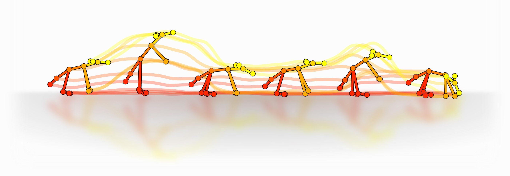

Keypoint MoSeq
==============

.. note::
    We detected a bug in versions 0.0.4 and 0.0.5 of keypoint-moseq that led to incorrect model outputs. **This affects you if you installed/updated the code between April 25 and May 5.** The bug has been fixed in version 0.1.0. You can update using ``pip install -U keypoint-moseq``.

Motion Sequencing (MoSeq) is an unsupervised machine learning method for animal behavior analysis. Given behavioral recordings, MoSeq learns a set of stereotyped movement patterns and when they occur over time. This package provides tools for fitting a MoSeq model to keypoint tracking data. 

Links
-----

- `Keypoint MoSeq GitHub <https://github.com/dattalab/keypoint-moseq/>`_

- `Google colab turorial <https://colab.research.google.com/github/dattalab/keypoint-moseq/blob/main/docs/keypoint_moseq_colab.ipynb>`_

- `Keypoint-MoSeq paper <https://www.biorxiv.org/content/10.1101/2023.03.16.532307v2>`_

- `Slack workspace <https://join.slack.com/t/moseqworkspace/shared_invite/zt-151x0shoi-z4J0_g_5rwJDlO1IfCU34A>`_

- `License <https://github.com/dattalab/keypoint-moseq/blob/main/LICENSE.md>`_

.. toctree::
   :caption: Setup
   
   install
   Google colab <https://colab.research.google.com/github/dattalab/keypoint-moseq/blob/main/docs/keypoint_moseq_colab.ipynb>

.. toctree::
   :caption: Tutorial

   tutorial
   changepoints

.. toctree::
   :caption: FAQs

   FAQs

.. toctree::
   :caption: Developer API

   fitting
   viz
   io
   util
   calibration
